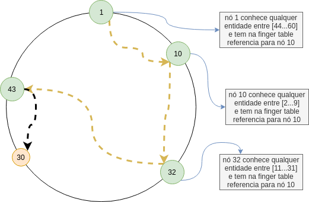
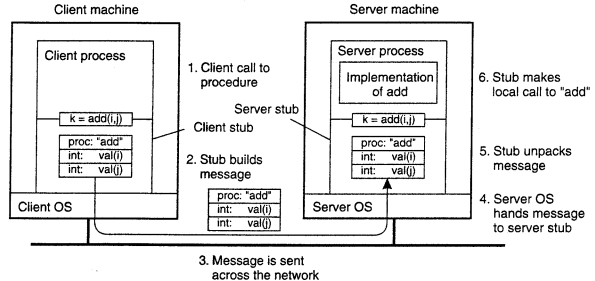

# Exercicios pré-prova: Sistemas Distribuidos

1. __O que é e para que serve uma DHT (tabela de hash distribuída)? Como é formada a estrutura (conceito de anel), o que é o sucessor de um nó, como são designados os recursos aos nós, o que é uma fingertable, como é preenchida a fingertable, como é realizada uma busca utilizando a fingertable, quanto demora uma busca na DHT. Faça um exemplo (com desenho) que permita visualizar os nós pelos quais passa a busca.__

__*Resposta:*__ 

Tabelas hash distribuidas sõa uma estratégia em sistemas distribuidos que gera uma função semelhante a relação chave<>valor. Sua estrutura é pensada como um anel lógico onde cada nó tem seu identificador. E cada entidade tem uma chave única. Cada entidade com chave _k_ esta sob a jurisdição do nó com o menor id >= k (sucessor).

Dessa forma os nós se comunicam entre sim até chegarem ao nó que contem a informação de uma certa entidade.

Para encontrar uma entidade de forma especifica, podemos olhar para uma tabela denomidade ```fingertable```. Tabela essa que informa a posição do proximo nó. Então buscamos uma certa entidade partindo de um nó de id ```1``` e caso a entidade que procuramos esteja sobre a jurisdição desse nó terminamos a busca. Caso contrario iremos para o proximo nó informado pela tabela ```fingertable```. Se distribuirmos de maneira exponencial os nós pelas entidades chegaremos a uma busca semelhante a uma busca binaria, ou seja. encontrar uma entidade na DHT nos custaria ```O(log N)```.



_referencias:_

[Finger Tables - Georgia Tech - Network Congestion](https://www.youtube.com/watch?v=GOOXa2GkPws)

[Distributed hash table - Wikipedia](https://en.wikipedia.org/wiki/Distributed_hash_table)

2. __Descreva os 4 estilos arquiteturais, mostre o desenho de cada uma deles, explique seu uso, evidenciando suas vantagens e desvantagens. Note que o pdf (aula04-cap2.pdf) só tem os slides 17 e 18, portanto é necessário procurar no livro (ou em outras fontes) mais informação.__

__*Resposta:*__ 

##### Arquiteturas centralizadas e multicamadas (multidivididas)

São arquiteturas tipicas de softwares comuns não distribuidos. São classicamente representadas pelo exemplo de uma aplicação web cliente/servidor. Onde toda interação do cliente pode resultar numa comunicação com o servidor porem nunca havera uma comunicação cliente/cliente.


##### Arquiteturas decentralizadas

São arquiteturas que não contem um hub ou um servidor mestre controlando toda a aplicação. É o caso d redes peer-to-peer por exemplo. As conexões costumam ser diretamente entre os clientes.


##### Arquiteturas Hibridas

Arquiteturas hibridas são arquiteturas em que a aplicação tanto usa de um servidor centralizado quanto de conexões direto com outros peers para a realização de suas tarefas. Esse caso ocorre tanto em serviços de Torrent quanto em serviços de video como o Skype.


_referencias:_

[Redes de Computadores - Wikibooks](https://pt.wikibooks.org/wiki/Redes_de_computadores/Camada_de_aplicação)

3. __Realize o desenho e explique o funcionamento básico de um RPC (slide 18 do aula06-cap4.pdf). Além disso, qual é a vantagem de usar uma RPC? Qual a desvantagem de usar uma RPC? Qual seria a diferença entre RMI e RPC?__

O RPC é baseado no conceito de executar processos do sistema operacional em outra maquina. fazendo _procedure calls_ numa maquina externa. A vantagem de usar PRC se da em casos onde o sistema distribuido em questão depende fortemente de interaçes com o sistema operacional e precisa de uma transparência na comunicação e execução das mensagems que estão sendo enviadas. As desvantagens ficam na garantia que essas maquinas externas sejam identicas a maquina que esta enviando essas chamadas.

Um exemplo de RPC é o Java RMI. Que é uma forma de uma maquina virtual java executar um processo localizado em outra maquina virtual java. Executando referências remotas.




_referencias:_

[M. van Steen and A.S. Tanenbaum, Distributed Systems, 3rd ed., distributed-systems.net, 2017.](https://www.distributed-systems.net)

[Uma introdução ao RMI em Java - DevMedia](https://www.devmedia.com.br/uma-introducao-ao-rmi-em-java/28681)


4. __Realize o desenho dos tipos de sincronização que existem na comunicação cliente/servidor, explicando quando são realizadas as sincronizações e explicando que tipos de comunicação existem (slide 13 aula06-cap4.pdf)__
